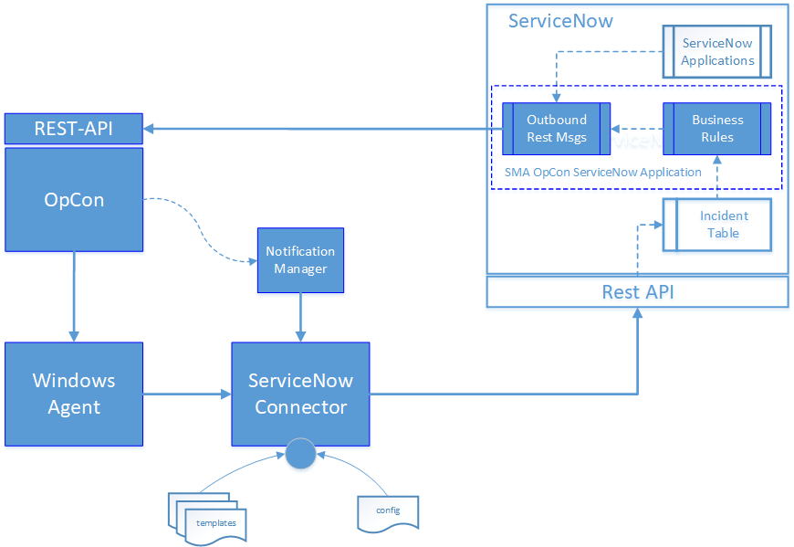
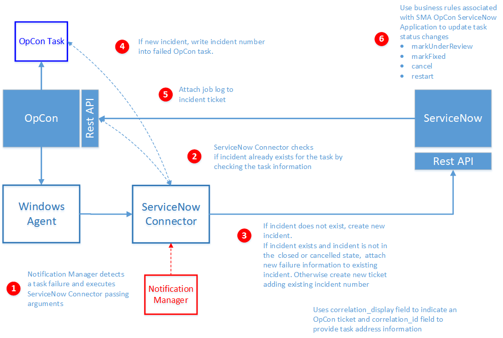

# ServiceNow Connector
The ServiceNow Connector can be used to submit incident tickets automatically to ServiceNow from OpCon when a task has an error condition. When the incident ticket is accepted in ServiceNow (State moved to **In Progress**) the task state in OpCon can automatically be changed to **Under Review** indicating that the error is being worked on. When the error is corrected and the ticket in ServiceNow state changes to Resolved, the task state in OpCon can be changed to either **Fixed** or **Restart**. If the ticket in ServiceNow is cancelled, the OpCon task can be automatically cancelled.

## Components
The OpCon ServiceNow implementation includes components that detect when a task errors, create the ServiceNow Incident record (includes adding task job log) and automatically update the OpCon task status when the Incident record Status changes.

### Notification Manager
An OpCon feature that initiates the ServiceNow Connector when a task encounters an error condition.
### Windows Agent
An OpCon Windows Agent that is used to execute the ServiceNow connector.
### ServiceNow Connector
An OpCon connector that communicates with ServiceNow through the ServiceNow Rest-API to create an incident.
### Templates
Contain the ServiceNow definitions to be used for that connection.
###	Config
Defines connection to the OpCon System, if a proxy server is required and directories used by the ServiceNow connector. 
### Business Rules
Part of a ServiceNow OpCon application that contains business Rules that are triggered when the Status of the incident ticket is updated.
- OpConTicketAccepted
- OpConTicketResolved
- OpConTicketRelease
- OpConTicketCanceled
### Outbound Rest Messages
Part of a ServiceNow OpCon application that contains Outbound Rest Messages to communicate with OpCon Through the OpCon Rest-API. This includes messages to update the task status as well as additional messages that can be used by other ServiceNow applications to issue instructions to OpCon.
- updateJobStatusById
- buildSchedule
- getDailyScheduleByNameAndDate
- addJobToScheduleInDaily
- getApiVersion

## Ticket Creation Process
The ticket creation process consists of the following steps (see Ticket Creation Process diagram).

**Step 1**:    
        
* The ServiceNow Connector is executed by the Notification Manager when a failed task is detected. 

* The Notification Manager uses the following standard OpCon properties to pass information to the ServiceNow Connector:

| Property | Description |
| -------- | ----------- |
| $MACHINE NAME | The name of the Agent on which the task was executing |
| $JOB TERMINATION | The termination code of the task |
| $SCHEDULE DATE-SNOW | A special version of the Schedule Date format created to support ServiceNow Connector |
| $SCHEDULE ID | The schedule ID of the workflow in the OpCon System |
| $SCHEDULE INST | The schedule instance of the workflow in the Daily OpCon table |
| $SCHEDULE NAME | The name of the workflow |
| $JOB NAME | The name of the task |

**Step 2**:

* Before creating a new incident ticket, the ServiceNow Connector checks to see if an incident ticket has already been created for the task. 

* The task information is extracted from the OpCon Daily Job table.

**Step 3**:

* If an incident ticket exists, the existing incident ticket is retrieved from ServiceNow and a check is made to see if the incident ticket state is closed or canceled. If the incident ticket is either closed or canceled, a new ticket is created. 

* The previous ticket number is attached to the task documentation and the incident ticket description. Otherwise, the ticket is updated reflecting the new task error information and the is re-opened (state set to New).

* When creating an incident ticket, the workflow name, the task name, the agent the task was executing on and the termination code are includedin the incident description. The correlation_display field is used to indicate that the request is from OpCon (sets the value to SMA_OPCON) and the correlation_id field is used to provide the identifier of the task that errored (includes the OpCon Rest-API address and the unique job id) allowing the business rules in the SMA OpCon ServiceNow Application to complete task status changes.

**Step 4**:

* The returned incident number and sys_id fields are written into the Job Information Incident Ticket ID field of the OpCon task. If there was an existing ticket and a new ticket was created, the previous ticket number is written into the task documentation field.

**Step 5**:

* If the rule **includeJobLogAttachment** is set to True, The ServiceNow Connector calls the OpCon Rest-API to retrieve the task’s job log and attaches this to the created or existing ServiceNow Incident ticket.

**Step 6**:

* The SMA OpCon ServiceNow Application, provides Business Rules that are triggered when the state of the Incident ticket is changed. These business rules then submit outbound Rest message calls to the OpCon Rest-API to change the task status. 

* The correlation_display value is used to determine if the updated incident ticket is an OpCon ticket and the correlation_id values are inserted into the outbound Rest message to route the message to the correct OpCon system and task.

The following Business rules are provided:

#### OpConTicketAccepted		

Triggered when the OpCon incident is updated and the state changes from ‘New’ to ‘In Progress’. The OpCon task is set to the markUnderReview status indicating that the problem is being worked on.

 #### OpConTicketResolved		
 
 Triggered when the OpCon incident is updated and the state changes from ‘In Progress’ to ‘Resolved’. The OpCon task is set to the markFixed status indicating that the problem has been fixed. The task can then be restarted.

#### OpConTicketRelease		

An alternate rule that is triggered when the OpCon incident is updated and the state changes from ‘In Progress’ to ‘Resolved’. The OpCon task is restarted.

#### OpConTicketCanceled	

Triggered when the OpCon incident is updated and the state changes to ‘Canceled’. The OpCon task is canceled. 

* When the incident is created, The **short description** and the **description** fields contain the workflow name, the task name, the agent name that was executing the task, the termination code and the date / time when the execution failed. The job log of the failed task can be accessed by double-clicking on the Manage Attachments in the upper left-hand corner.

* The ServiceNow incident can be referenced directly from OpCon by selecting the Incident Ticket value in the Job Selection view in the Operations View of Solution Manager.

